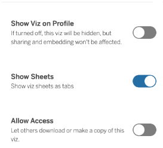

# data-viz-mock-belt-exam

Use a Private GitHub repository to save all of your files and perform your analysis.

<h3>Part 1</h3>

<ul>

<li>Download and unzip the zip file provided to you <a href="https://drive.google.com/file/d/1qszDl9TklrXD1kHuu7vtJXsEm2lwbIQ-/view?usp=share_link">here</a>. 
<ul>
 
<li>Unzip the files into your private repository.
</li> 
</ul>

<li>Load the provided joblib file. Display the .keys of the dictionary stored in the joblib file.

<li>Assign each of the keys from the dictionary as a separate variable.

<li>Use the preprocessor to transform the X_train/X_test data into processed dataframes. 

<li>Replace the column names with the correct feature names extracted from the preprocessor.  
</li>
</ul>
<h3>Explain the Linear Regression Model:</h3>

<ul>

<li>Extract the coefficients and save them as a Series with the correct feature names as the index.

<li>Change the pandas option for float format to display the coefficients with pandas in a readable form: 
<ul>
 
<li> separator for thousands
 
<li>2 decimal places.
</li> 
</ul>

<li>Create a bar graph of the coefficients, sorted from largest to smallest. 
<ul>

<li>Provide a quantitative interpretation (both magnitude and directionality) of the three largest positive coefficients explaining how that feature impacts the target.

<li>Provide a quantitative interpretation (both magnitude and directionality)  of the three largest negative coefficients explaining how that feature impacts the target.
</li>
</ul>
</li>
</ul>
<h3>Explain the Random Forest Model:</h3>

<ul>

<li>Extract and create a bar graph of the feature importances, sorted from largest to smallest. 

<li>What are the top 6 most important features? 

<li>Of the top 6 most important features, identify which of these features also appeared in the 3 largest or 3 smallest coefficients. 
</li>
</ul>

<strong>Apply Shap to Explain the Random Forest Model</strong>

<ul>

<li>Sample 500 rows of the processed X_train data as X_shap, using random_state=321

<li>Save the corresponding y_train values as y_shap

<li>Create a shap model explainer for the random forest model

<li>Calculate the shap values for the sampled data

<li>Create a summary plot (kind=’dot’) of the most important features, according to shap.

<li>Interpret the top 6 most important features. According to shap, what effect does each feature have on the model’s prediction?
</li>
</ul>

<strong>Part 2</strong>

<ul>

<li>Load the provided csv, located in the zip file you downloaded in Part 1.

<li>Prepare the data as a time series DataFrame: 
<ul>
 
<li>Melt the wide-form data into a long-form time series.  
<ul>
  
<li>The date column should be named “Date”
  
<li>The value column should be named “Confirmed”
</li>  
</ul>
 
<li>Convert the Date column to a Datetime index.
 
<li>Set the Date column as the index
</li> 
</ul>

<li>Filter the data: 
<ul>
 
<li>Keep data from the following states:   
<ul>
  
<li> 'New York', "New Jersey", "Pennsylvania", 'Delaware', 'Rhode Island', 'Maryland', "Virginia", "North Carolina"
</li>  
</ul>
 
<li>Keep all data from 05/2020 to the present.
</li> 
</ul>

<li>Save the processed data as a  .csv file in a “Data” folder inside your private repo, name the csv “Data/data-for-tableau.csv”

<li>Resample the cases, grouped by states, to monthly frequency using sum as the aggregation function.

<li>Plot a line graph with each of the states as a separate line.
</li>
</ul>

<strong>Part 3</strong>

<ul>

<li>Create a new tableau workbook and load the “data-for-tableau.csv” from part 2.

<li>Change FIPS to a Dimension. This is a unique numeric identifier for counties. 
<ul>
 
<li>Finally, assign it a Geographic Role > County.
</li> 
</ul>

<li>Create a hierarchy called “Location” using the following: 
<ul>
 
<li>Country Region
 
<li>Province State
 
<li>Fips
</li> 
</ul>

<li>Create a set of the top 20 Counties (“FIPS” field),  according to the sum of the Confirmed field. Name this set  “Counties with Most Cases”.
</li>
</ul>
<ul>

<li><strong>Create a Tableau story with the following:</strong> 
<ul>
 
<li>Story Point 1) A bar graph of Confirmed cases by Location (Specifically: State, FIPS, excluding Country for the 20 Counties with the Most Cases.  
<ul>
  
<li>Filter the visualization to only show the Counties with the Most Cases.
  
<li>Color the bars by State.
</li>  
</ul>
</li>  
</ul>
</li>  
</ul> 
<ul>
 
<li>Story Point 2) A line graph of the change in Confirmed cases by Year/Month Eg (12/2020, 01/2021, etc.), colored by State.  
<ul>
  
<li>Use a filter to include only September, 2020 - December 2022
  
<li>For each state, calculate the % difference in the Confirmed # of cases vs. the previous date.
  
<li>Use annotation to answer the question, which state had the largest % increase in cases, and between which months did it occur? 
</li>  
</ul>
</li>  
</ul>

<strong> </strong>

 
<ul>
 
<li>Story Point 3) A highlight table of the 20 Counties with the Most Cases.  
<ul>
  
<li>Include the following columns:   
<ul>
   
<li>Province State
   
<li>FIPS
   
<li>Confirmed Cases
</li>   
</ul>
  
<li>Only include the top 20 counties with the most cases.
  
<li>Filter the table by Month/Year and select December 2022 as the default.   
<ul>
   
<li>Show the filter on the visualization as a single value slider.
</li>   
</ul>
  
<li>The highlight table should be colored by Confirmed cases.
</li>  
</ul>
</li>  
</ul> 
<ul>
 
<li>Story Point 4) Create a choropleth map of the sum of Confirmed cases by FIPS county code.  
<ul>
  
<li>Filter by Month & Year, with a default value of 12/2022   
<ul>
   
<li>Show the filter on your visualization as a single-value slider
</li>   
</ul>
  
<li>Color your visualization by the sum of Confirmed cases
  
<li>Add the UID field to the tooltip.
  
<li>Change the Style of the background map layer to Dark.
<ul>

<li>Make sure to include all 4 views in your story with an appropriate caption for each story point before saving your workbook.
</li>
</ul>
</li>
</ul>
</li>
</ul>
<ul>

<li><strong>Save the workbook to Tableau Public with your Story as the current view.</strong> 
<ul>
 
<li><strong>Use the following settings on your online workbook:</strong>  
<ul>
  
<li>Show Viz on Profile: OFF
  
<li>Show Sheets: ON
  
<li>Allow Access: OFF
</li>  
</ul>
 
<li>Your setting should match the screenshot below:  

</li> 
</ul>

<li><strong>Create a share link and insert the share link into a markdown cell at the bottom of your notebook in a new section with the header: “# Tableau Workbook”</strong>
</li>
</ul>

<strong>Final Deliverables: </strong>

<ul>

<li>All of your files should be saved in a PRIVATE GitHub repository. 
<ul>
 
<li>Make sure your name has the following format: "First-Last__Belt-Exam-A" (Please make sure you use two underscores after your name).
</li> 
</ul>

<li>Make sure your jupyter notebook has all 3 sections, <strong>including your tableau workbook link.</strong>

<li>Make sure that your data is included in your repo as well (joblib and csv’s). 

<li>Download your final repository as a zip file on github.com (not from GitHub Desktop).

<li>Submit the single zipped file.

<li><strong>Email a backup submission to your instructor.</strong>
</li>
</ul>
<h3>Notes:</h3>

<ul>

<li>To prevent other students from copying your work, please make sure code is saved on a PRIVATE GitHub.

<li>To minimize score deduction, please make sure your notebook fulfills all of the requirements above before uploading. 

<li>If you are having trouble uploading files on the Exam App, please DO NOT unlock another exam. Please email the file to your instructor.

<li>You may use any resources you have available (class notes, Google, Stackoverflow etc.) - BUT YOU MUST CITE ANY SOURCES USED. You must cite sources in the form of a code comment or a text cell where you use any borrowed code with links to any resources you used. Failure to cite sources will be considered plagiarism and result in failing the exam.

<li>You may NOT get or receive help from any other person with your code. This includes classmates, alumni, your instructor, etc. Collaboration with another person on this exam will be considered plagiarism and can result in dismissal from the program.